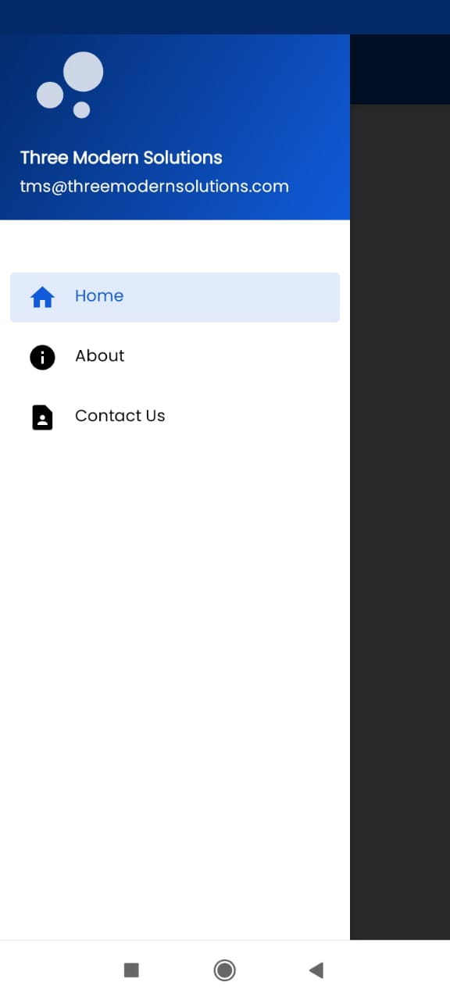
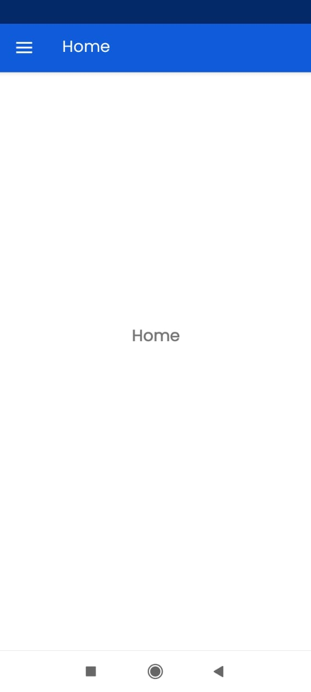
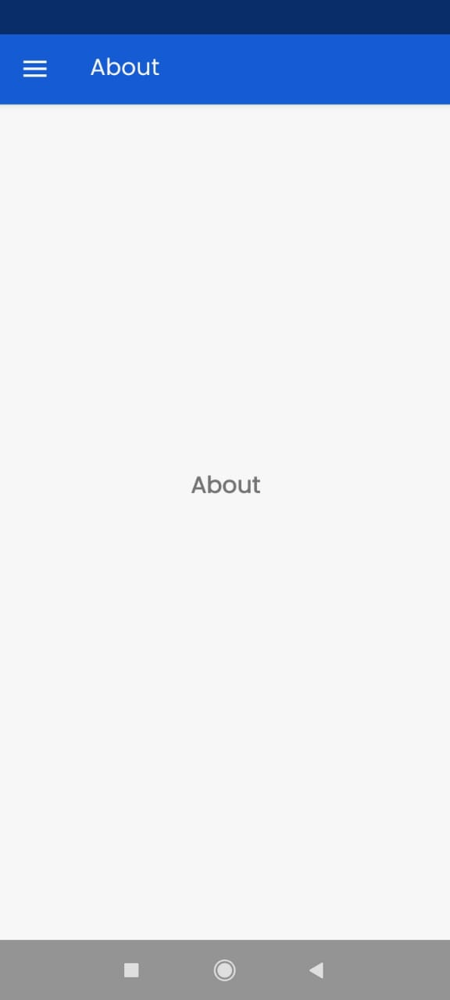
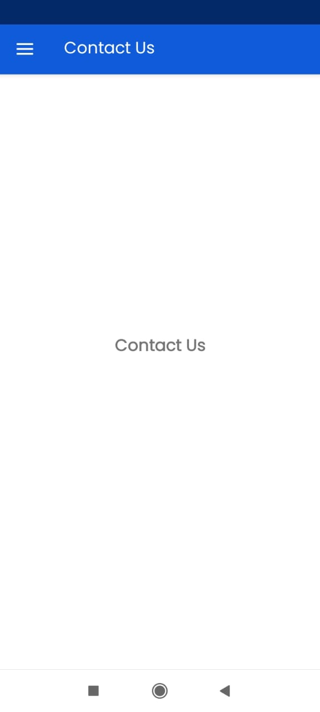

# TMS

A simple Android application written in Kotlin.

It has 3 fragments that can be accessed through a navigation drawer

## Screenshots

    

        <h3>Navigation Drawer</h3>
        
    

    

        <h3>Home Screen</h3>
        
    

    

        <h3>About Screen</h3>
        
    

    

        <h3>Contact Us Screen</h3>
        
    

